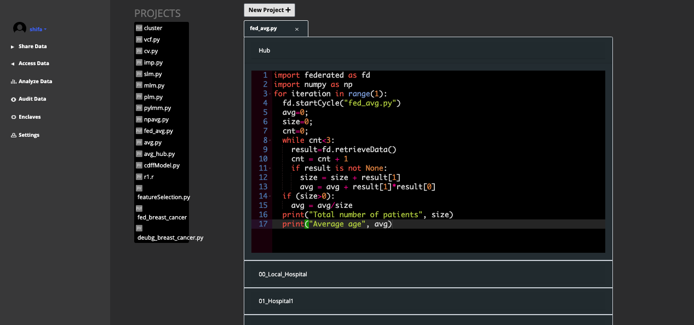
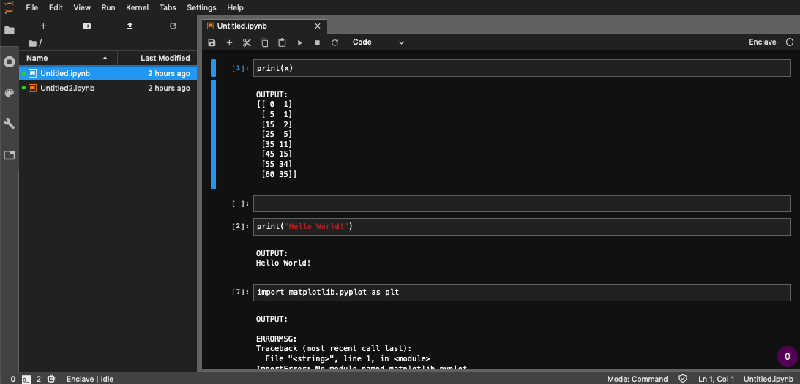

# Welcome to the Titanic Cleaning Tutorial 
by Anne and Frank

## Step 1 Download the dataset
The dataset can be found either on <a href="https://www.kaggle.com/c/titanic">Kaggle</a> for download or in the data <a href="../../data/titanic.zip">folder</a> 

## Step 2 Start SAIL Platform
### SAIL Classic
Navigate to <a href="https://app-dev.secureailabs.com/analysis">https://app-dev.secureailabs.com/analysis</a>

### SAIL Jupyter Notebook
Navigate to <a href="http://app-dev.secureailabs.com:8888/lab">http://app-dev.secureailabs.com:8888/lab</a>

## Extra

Platform Screenshot

